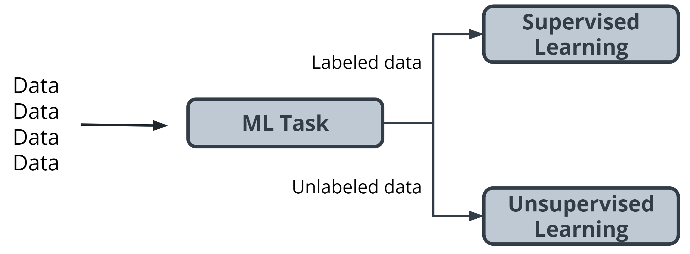

# Introduction to Machine Learning
Machine learning is creating rapid and exciting changes across all levels of society because :
- serves as an  engine behind the recent advancements in industries such as autonomous vehicles.
- allows for more accurate and rapid translation of the text into hundreds of languages.
-  powers the AI assistants you might find in your home.
-  improve worker safety and speeds up drug design.

## Lesson Outline
------------------------------------------------
[ ] Discuss what machine learning is, common terminology, and common components involved in creating a machine learning project.

[ ]  Step into the shoes of a machine learning practitioner. Machine learning involves using trained models to generate predictions and detect patterns from data. To understand the process willbe broken down into different steps involving and examining a common process that applies to the majority of machine learning projects.

[ ] Examine  three examples , using the steps to described to solve real-life scenarios that might be faced by machine learning practitioners.

### Objectives
------------------------------------------------
- Differentiate between supervised and unsupervised learning .
- Identification of problems that can be solved with ML.
- Describe commonly used ML algorithms eg K-means ,regression e.t.c
- Describe model training and testing work.
- Performance Evaluation of ML model using metrics.

---------------------------------------

### What is ML (Machine Learning) 

Allowing computers to automatically learn and improve from experience without being explicitly programmed to do so , ML can be defined thus. Machine Learning is a modern software development techniques and a type of AI that enables computers to solve problems by using examples of real-world data as a source.

Machine learning is concerned with enabling machines to have capabilities of performing human-like operation while using human like intelligence

- Supervised Learning
    A labelled training sample from a given dataset is used by an ML algorithm  to make predictions of output values.
- Unsupervised Learning
    A machine learning algorithm tries to learn how to make prediction by learning underlying patterns present / distribution that governs the dataset.
- Reinforcement Learning
    Using reward based system to train a model . This is by making algorithms figure out the best way to maximize the reward on the way to achieving a goal


In machine learning, the problem solver abstracts away part of their solution as a flexible component called a model, and uses a special program called a model training algorithm to adjust that model to real-world data. The result is a trained model which can be used to predict outcomes that are not part of the data set used to train it.


```py
""""
__________________      ____________
|  machine       | ---->|  model   |----    ___________________
|learning model  |      | training |    \   | model inferencing|
|________________|      | algorithm|     |->|   algorithm      |
                        |__________|        +__________________+
"""
```

>A machine learning model is a block of code or framework that can be modified to solve different but related problems based on the data provided.

- machine learning model cleans dataset , had predict to what goal should be achieved
- model training algorithm tries to mode the input in the direction of the goal repeatedly
- model inferencing : check to see how valid the changes made in step above are.
  
## Terminology
+ A model is an extremely generic program, made specific by the data used to train it.

+ Model training algorithms work through an interactive process where the current model iteration is analyzed to determine what changes can be made to get closer to the goal. Those changes are made and the iteration continues until the model is evaluated to meet the goals.

+ Model inference is when the trained model is used to generate predictions.

## Major Steps in the Machine Learning process
----------------------------------------------------
+ Problem Definition:
    Think about a specific problem then introduce valid questions . Identify the machine learning task we might use to solve this problem . Characteristic of dataset help in classifying problem to ML task either using label or not.

    
    A task is ```supervised``` if when   labeled data is used else it is ```unsupervised```. Unsupervised learning involves using data that doesn't have a label. One common task is called clustering. Clustering helps to determine if there are any naturally occurring groupings in the data.

    

In supervised learning, there are two main identifiers you will see in machine learning:
+ A ```categorical``` label has a discrete set of possible values. In a machine learning problem in which you want to identify the type of flower based on a picture, you would train your model using images that have been labeled with the categories of flower you would want to identify. Furthermore, when you work with categorical labels, you often carry out classification tasks*, which are part of the supervised learning family.
+ A ```continuous``` (regression) label does not have a discrete set of possible values, which often means you are working with numerical data. In the snow cone sales example, we are trying to predict the number* of snow cones sold. Here, our label is a number that could, in theory, be any value.
+ DataSet Construction
+ Model Training
+ Model Evaluation
+ Model inferencing


### Additional Learning Material
 - The [AWS Machine Learning blog](https://aws.amazon.com/blogs/machine-learning/) is a great resource for learning more about projects in machine learning.
 - You can use [Amazon SageMaker](https://aws.amazon.com/blogs/machine-learning/calculating-new-stats-in-major-league-baseball-with-amazon-sagemaker/) to calculate new stats in Major League Baseball.
 - You can also find an article on [Flagging suspicious healthcare claims with Amazon SageMaker](https://aws.amazon.com/blogs/machine-learning/flagging-suspicious-healthcare-claims-with-amazon-sagemaker/) on the AWS Machine Learning blog.
What [kinds of questions and problems](https://docs.aws.amazon.com/machine-learning/latest/dg/machine-learning-problems-in-amazon-machine-learning.html) are good for machine learning?
